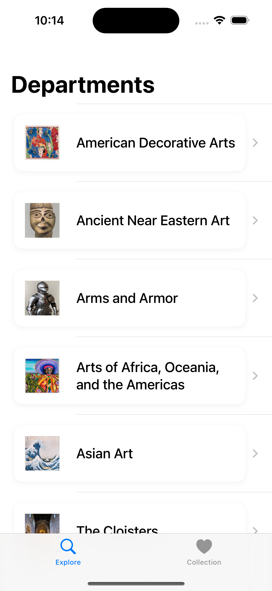
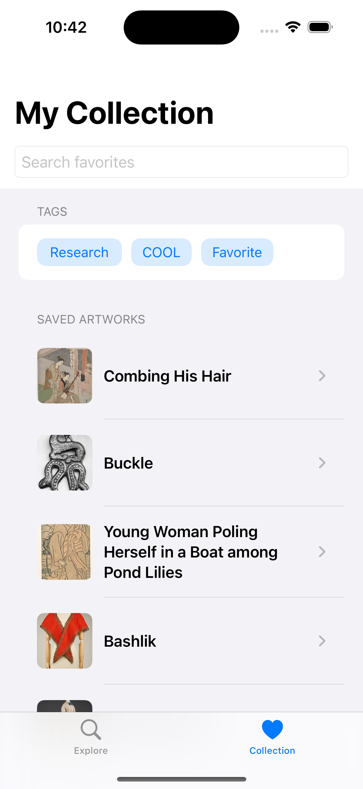
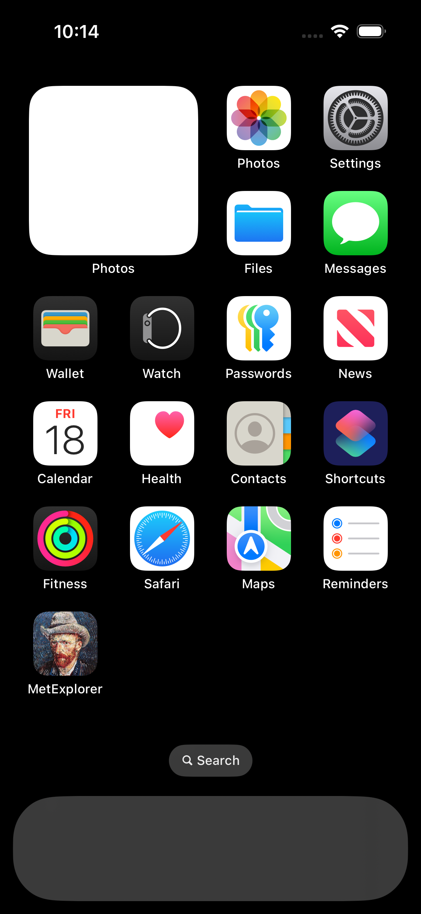

# MetExplorer

  MetExplorer is an iOS app that allows users to explore artwork from the Metropolitan Museum of Art (The Met) using their public REST API. Users can browse collections by department, view detailed artwork information, save favorite pieces, and organize their collections using custom tags.

  ## 📱 Features

  - Browse artworks by department using a **NavigationStack** interface
  - View detailed information for each artwork, including title, artist, culture，medium, and etc
  - **Zoom in** to view artwork images in full-screen mode with pinch gestures
  - Search and filter artworks by keywords，culture and medium
  - Mark artworks as favorites and organize them using **custom tags**
  - Create and manage custom tag categories stored locally using **SwiftData**
  - See your favorite collection in a dedicated **My Collection** tab
  - Search through your personal collection
  - Clean UI with **error handling** and user-friendly alerts

  ## ✅ Requirement Checklist

  ### REST API 
  - [x] Uses URLSession to fetch data from The Met’s API
  - [x] Decodes JSON into Swift model objects
  - [x] Displays user-friendly messages when errors occur

  ### NavigationStack
  - [x] Department → ArtworkList → ArtworkDetail with NavigationStack
  - [x] Titles reflect current content (e.g., department name as title)
  - [x] Navigation behaves as expected (no glitches)

  ### User Interaction 
  - [x] Searchable list (manual search bar used to workaround iOS 18.4 bug)
  - [x] Filter artworks by medium or culture
  - [x] Favorite artworks with one-tap tagging and removal
  - [x] Tag management with real-time UI update
  - [x] Full-screen **zoomable image viewer** for artwork

  ### Data Storage (SwiftData) 
  - [x] Stores user’s favorites and custom tag categories locally
  - [x] Reloads persisted data on launch

  ### Tab Bar 
  - [x] TabView with “Find” and “Collection” sections
  - [x] Clear labels and SF Symbols used

  ## ⚙️ Technical Details
  - Built using SwiftUI, Swift 6, and SwiftData
  - ViewModels use `@Observable` for Swift Concurrency compatibility
  - Async/await used exclusively for data fetching
  - Proper error messages shown using alerts and `ContentUnavailableView`
  - HTML in artwork titles is parsed and rendered using AttributedString

  ## 📁 Project Structure
  ```
  MetExplorer/
  ├── Models/         // Artwork, Department, FavoriteItem, UserTag..
  ├── Views/          // DepartmentListView, ArtworkListView, CollectionView..
  ├── ViewModels/     // DepartmentViewModel, ArtworkListViewModel..
  ├── Networking/     // MetMuseumAPI, APIError
  ├── Resources/      // Assets, Preview Content
  ```

  ## 🚀 Run Instructions
  1. Open `MetExplorer.xcodeproj` in Xcode 16+
  2. Ensure the simulator is set to iOS 18.4 or higher
  3. Run the app on iPhone 16 simulator (recommended)

  ## 🧭 Planned Upgrades
- **My Collection**: sorting, multi-tag filtering, visual tag indicators  
- **Artwork sharing & export**: PDF, social cards  
- **Context enrichment**: Wikipedia integration, ChatGPT AI-generated descriptions  
- **Image pipeline**: skeleton loading, caching, progressive loading  
- **Accessibility**: Dark Mode, Dynamic Type, VoiceOver support  
- **System integration**: WidgetKit, App Intents (Siri/Shortcuts), Core Spotlight  
- **Collection insights**: simple analytics with Swift Charts  
- **Cross-device sync**: iCloud / CloudKit for favorites and tags  
- **Advanced features (optional)**: MapKit for artwork locations, ARKit for real-world previews, TipKit onboarding


  ## Code Stats
  ### Total Lines of Code
  2108

## 📸 App Screenshots

<table>
  <tr>
    <td align="center" style="padding:15px; background:#ffffff">
      <br/>
      <sub>Department</sub>
    </td>
    <td align="center" style="padding:15px; background:#ffffff">
      <br/>
      <sub>Artwork List</sub>
    </td>
    <td align="center" style="padding:15px; background:#ffffff">
      <br/>
      <sub>Artwork Filter</sub>
    </td>
    <td align="center" style="padding:15px; background:#ffffff">
      <br/>
      <sub>Artwork Search</sub>
    </td>
  </tr>
  <tr>
    <td align="center" style="padding:15px; background:#ffffff">
      <br/>
      <sub>Artwork Information</sub>
    </td>
    <td align="center" style="padding:15px; background:#ffffff">
      <br/>
      <sub>Artwork Description</sub>
    </td>
    <td align="center" style="padding:15px; background:#ffffff">
      <br/>
      <sub>Artwork Image</sub>
    </td>
    <td align="center" style="padding:15px; background:#ffffff">
      <br/>
      <sub>Image Zoomable</sub>
    </td>
  </tr>
  <tr>
    <td align="center" style="padding:15px; background:#ffffff">
      <br/>
      <sub>Add to Collection</sub>
    </td>
    <td align="center" style="padding:15px; background:#ffffff">
      <br/>
      <sub>Custom Tag</sub>
    </td>
    <td align="center" style="padding:15px; background:#ffffff">
      <br/>
      <sub>My Collection Empty</sub>
    </td>
    <td align="center" style="padding:15px; background:#ffffff">
      <br/>
      <sub>My Collection</sub>
    </td>
  </tr>
  <tr>
    <td align="center" style="padding:15px; background:#ffffff">
      <br/>
      <sub>Tag Filter Artworks</sub>
    </td>
    <td align="center" style="padding:15px; background:#ffffff">
      <br/>
      <sub>Error View</sub>
    </td>
    <td align="center" style="padding:15px; background:#ffffff">
      <br/>
      <sub>Error View</sub>
    </td>
    <td align="center" style="padding:15px; background:#ffffff">
      <br/>
      <sub>App</sub>
    </td>
  </tr>
</table>
